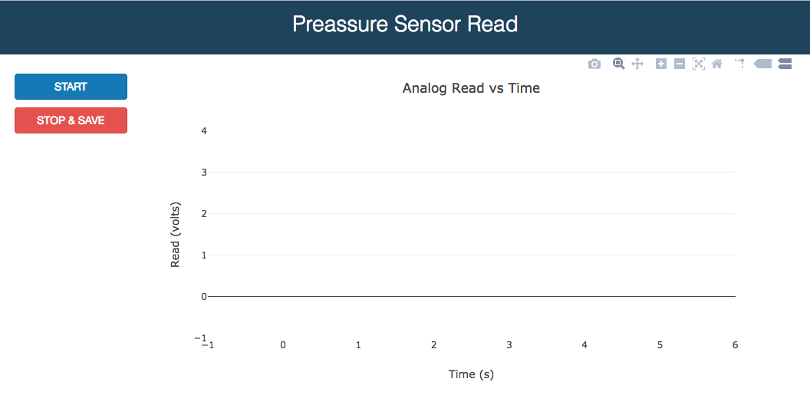
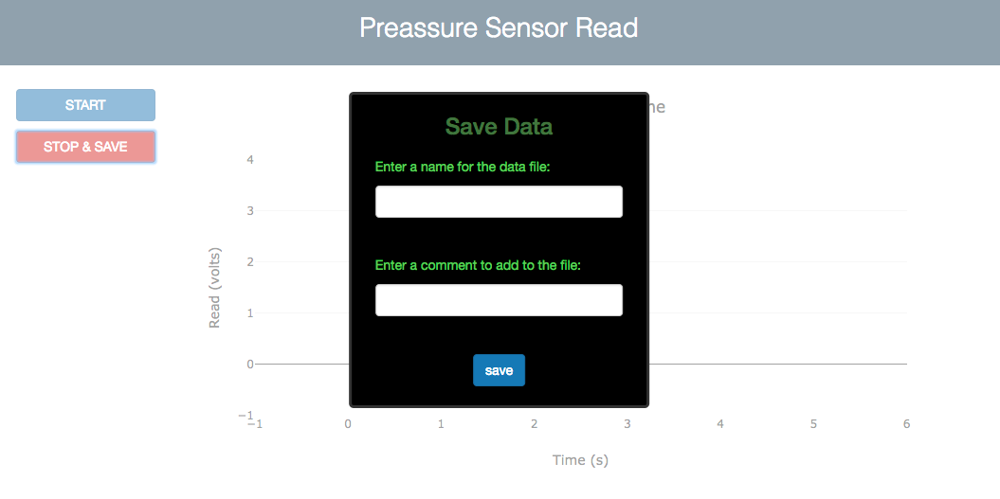

# Arduino Data Read

Data acquisition software for the Arduino analog input.

The acquisition routine is a server written in node.js and uses the library [johnny-five](http://johnny-five.io/) for Arduino.

The GUI is implemented with a web app connected to the server using [socket.io](https://github.com/socketio/socket.io).

Install these dependencies with: `npm install socket.io johnny-five --save`

## How to use it

#### Prepare your Arduino
1. Download and install the Arduino IDE so that you can upload libraries to your Arduino (in  https://www.arduino.cc/en/main/software go to "Download the Arduino IDE").

2. Connect the Arduino via usb to the computer, open the IDE and go to the menu `File > Examples > Firmata > StandardFirmataPlus`. A window will appear with the corresponding library. Press the button `upload` (or go to the menu `Sketch > Upload`) and wait till the library is fully uploaded to the Arduino.

3. Close the IDE program. Your hardware is ready.

#### Acquisition software
Clone or download this repo and then:

1. Connect the Arduino to the computer via USB and connect your analog signal input to the A0 pin of the Arduino. The ground should also be connected to the pin GND of the Arduino.

2. In the Terminal, go to the directory where this repo has been downloaded and run the node program:
`node index.js`. A message will confirm that the device has been detected ("Arduino connected"). You can interrupt the execution at any time by pressing CTRL + C twice.

3. Open the file `index.html` in your favourite browser (I have tested it only in Chrome). This will give you the GUI that connects to the acquisition backend.

4. Press `START` to start acquiring data. It is important to note that not all the data acquired in the backend is represented in this frontend. Due to limitations in the number of points that the browser can handle, the measuring rate (about 100 ms) is different than the displaying rate (about 1000 ms).

5. When you press `STOP & SAVE` a panel will show up asking for a name and a comment for the file in which the data will be saved. If these fields are left empty, the file will be saved anyway with a default name containing the date and time of the acquisition. The data consists of two columns; the time in milliseconds from the moment you pressed `START` and the voltage in volts measured in the analog input of the Arduino.

## Screenshots:

#### Acquisition panel

#### Save dialog

## Containerized version

The Dockerfile is an attempt of wrapping the application in a Docker container.
The trouble with this approach is that the USB port is not accessed by the container by default in OSX and Windows. See [this link](https://medium.com/google-cloud/developing-for-arduino-with-docker-and-johnny-five-on-osx-cc6813ae6e9d) to learn how to use Arduino with Docker through the USB. For USB 3, the [Oracle VM VirtualBox Extension Pack](https://www.virtualbox.org/wiki/Downloads) for Virtual Box is required.

> Jesús Martínez-Blanco

> jmb.jesus@gmail.com
